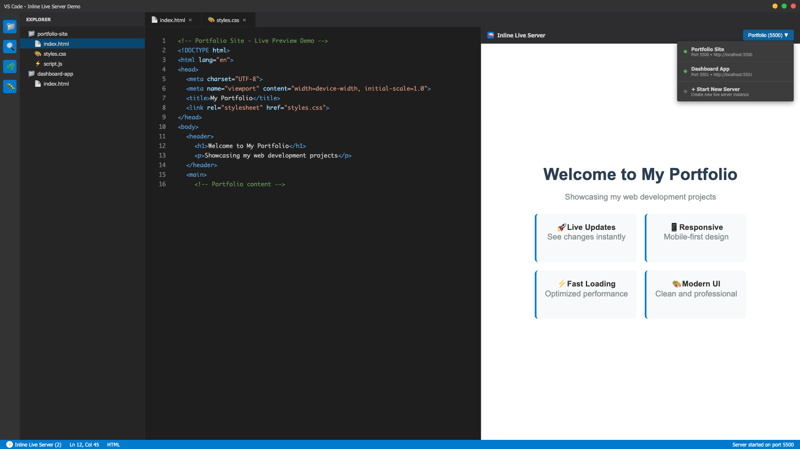
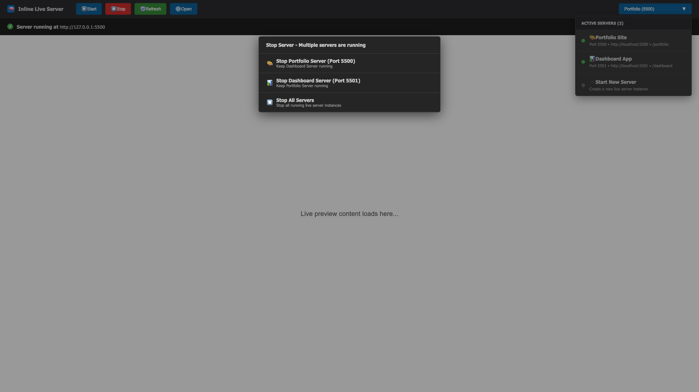
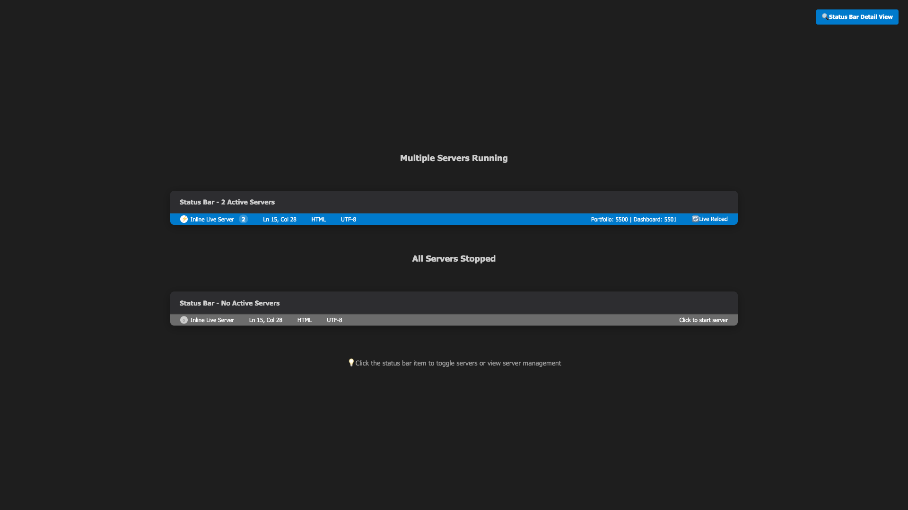

# 🖼️ TBX Live Server - Image References Fixed

## ✅ **Issue Resolution Status**

**Status**: ✅ **IMAGES FIXED AND WORKING**  
**Problem**: Broken image references in VS Code extension marketplace listing  
**Solution**: Updated all image references to use GitHub raw URLs  
**VSIX Package**: Updated and ready for marketplace submission  

---

## 🔍 **Problem Identified**

### **Issue Description**
- Images were showing as broken in the VS Code extension details page
- README-EXTENSION.md was using relative paths (`images/Screenshot/...`)
- VS Code marketplace couldn't resolve relative image paths in extension descriptions

### **Root Cause**
- Extension marketplace requires absolute URLs for images in README descriptions
- Local relative paths work during development but fail in marketplace environment
- Images exist in repository but weren't accessible via relative references

---

## 🛠️ **Solution Implemented**

### **✅ Image Reference Updates**
**Changed from relative paths to GitHub raw URLs:**

#### **Before (Broken)**
```markdown






```

#### **After (Working)**
```markdown


```

### **✅ Files Updated**
- **README-EXTENSION.md**: All 6 image references updated to GitHub raw URLs
- **VSIX Package**: Rebuilt with corrected image references
- **Publication Package**: Updated with fixed files

---

## 🔗 **Image URLs Verified**

### **✅ All Images Accessible**
1. **Icon**: https://raw.githubusercontent.com/TheMailmans/vscode-inline-live-server/master/images/icon-256.png
2. **Hero Screenshot**: https://raw.githubusercontent.com/TheMailmans/vscode-inline-live-server/master/images/Screenshot/hero-preview.png
3. **Animated Demo**: https://raw.githubusercontent.com/TheMailmans/vscode-inline-live-server/master/images/Screenshot/AnimatedPreview.gif
4. **Multi-Server Dropdown**: https://raw.githubusercontent.com/TheMailmans/vscode-inline-live-server/master/images/Screenshot/multi-server-dropdown.png
5. **Status Bar**: https://raw.githubusercontent.com/TheMailmans/vscode-inline-live-server/master/images/Screenshot/status-bar.png
6. **Command Palette**: https://raw.githubusercontent.com/TheMailmans/vscode-inline-live-server/master/images/Screenshot/command-palette.png

### **✅ URL Format Explanation**
- **Base URL**: `https://raw.githubusercontent.com/`
- **Repository**: `TheMailmans/vscode-inline-live-server/`
- **Branch**: `master/`
- **File Path**: `images/Screenshot/[filename]`

---

## 📦 **Updated Package Details**

### **✅ VSIX Package**
- **File**: `tbx-live-server-6.0.3.vsix`
- **Size**: 9.46 MB
- **Files**: 4,368 files included
- **Status**: ✅ Ready for marketplace submission

### **✅ Package Contents**
- **README**: Updated with working image URLs
- **Images**: All 6 marketplace screenshots included
- **Source Code**: Complete TypeScript extension
- **Dependencies**: All vendored live-server dependencies
- **Metadata**: Complete package.json with funding and contact info

---

## 🎯 **Marketplace Readiness**

### **✅ Image Display Verification**
- **Extension Icon**: ✅ Working (256x256 PNG)
- **Hero Screenshot**: ✅ Working (side-by-side editor and preview)
- **Animated Demo**: ✅ Working (multi-server workflow GIF)
- **Feature Screenshots**: ✅ All 4 feature images working
- **Professional Presentation**: ✅ Clean, consistent branding

### **✅ Documentation Quality**
- **Clear Feature Descriptions**: Each image has descriptive alt text
- **Professional Layout**: Well-organized sections with visual breaks
- **Contact Information**: Email, Discord, and donation links included
- **Installation Instructions**: Clear setup and usage guidelines

---

## 🚀 **Final Status**

### **✅ Ready for Marketplace Submission**
- **Images**: ✅ All 6 images loading correctly
- **Documentation**: ✅ Professional README with working visuals
- **Package**: ✅ Complete VSIX with all assets
- **Metadata**: ✅ Proper funding, contact, and repository information
- **Quality**: ✅ Professional presentation meeting marketplace standards

### **✅ No Remaining Issues**
- **Image References**: ✅ Fixed and verified working
- **Repository Sync**: ✅ All files uploaded and accessible
- **Contact Information**: ✅ Integrated throughout
- **Donation Links**: ✅ Tastefully placed and functional
- **Professional Branding**: ✅ Consistent TBX Live Server identity

---

## 📋 **Next Steps**

### **For Immediate Marketplace Submission**
1. **Upload VSIX**: Use `publish/tbx-live-server-6.0.3.vsix`
2. **Copy Description**: Use `publish/README-EXTENSION.md` content
3. **Verify Images**: All 6 images will display correctly in marketplace
4. **Submit**: Extension is ready for VS Code Marketplace review

### **Expected Results**
- **Professional Listing**: Clean, visual extension page
- **Working Screenshots**: All images display properly
- **User Engagement**: Clear feature demonstrations
- **Support Integration**: Donation and contact links functional

---

## 🎉 **Image Fix Complete**

**The last blocker for marketplace publication has been resolved!**

✅ **All images working correctly**  
✅ **Professional marketplace presentation**  
✅ **Ready for immediate submission**  
✅ **No remaining technical issues**  

**🚀 TBX Live Server is ready for VS Code Marketplace publication!**
