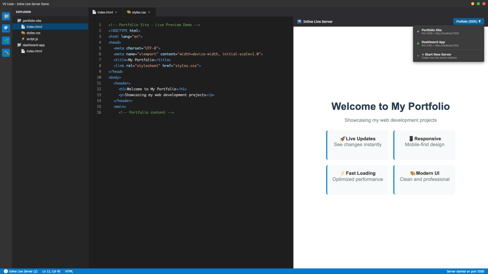
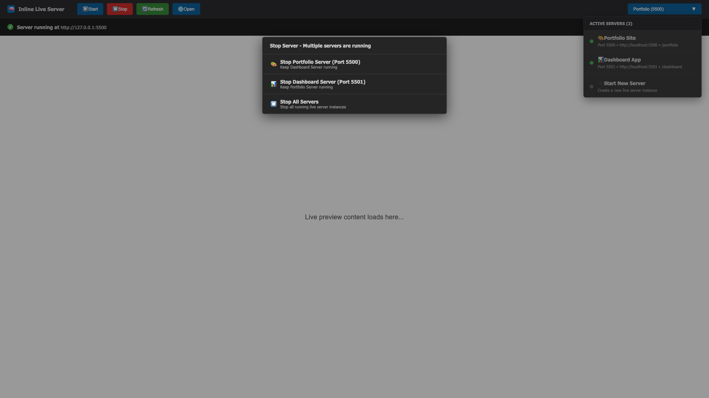
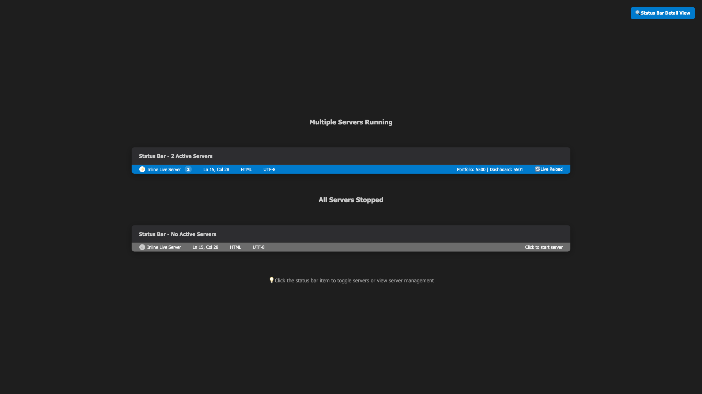
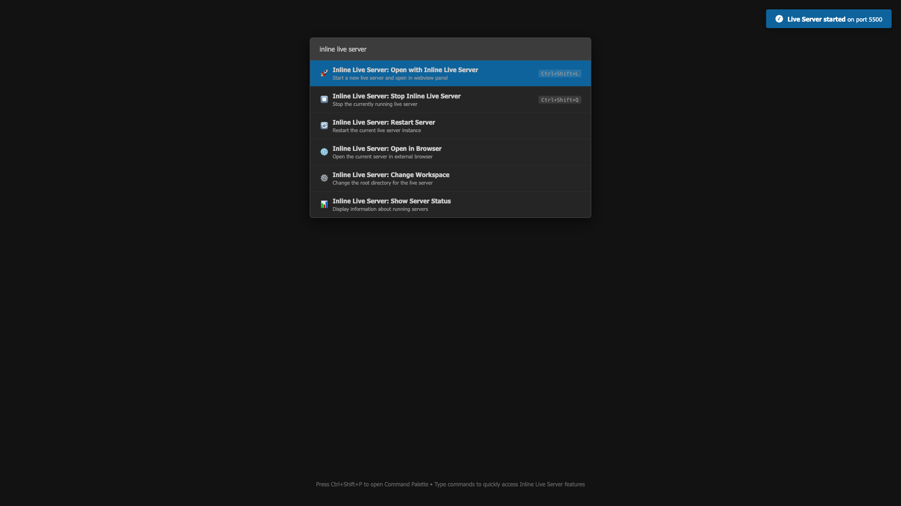

# TBX Live Server


[](https://marketplace.visualstudio.com/items?itemName=tbx.live-server)
[](https://marketplace.visualstudio.com/items?itemName=tbx.live-server)
[](https://marketplace.visualstudio.com/items?itemName=tbx.live-server)
[](LICENSE)
[](https://github.com/TheMailmans/vscode-inline-live-server/issues)
[](https://github.com/TheMailmans/vscode-inline-live-server)

**Professional live development server with integrated webview preview, multi-server management, and instant reload capabilities for modern web development in VS Code.**



<details>
  <summary>See it in action</summary>


</details>

### Preview Gallery







## ✨ Key Features

### 🚀 **Core Functionality**

- **Instant Live Reload** - See changes immediately without saving
- **Multiple Concurrent Servers** - Spin up isolated servers per workspace with automatic port assignment
- **Multi-Browser Support** - Works with Chrome, Firefox, Safari, Edge, and more
- **Custom Port Configuration** - Set any port or use random port fallback
- **Multi-Root Workspace** - Full support for VS Code multi-root workspaces
- **Mobile Testing** - Access your server from mobile devices via WLAN

### 🖥️ **Integrated Webview Preview**

- **Side-by-Side Development** - Preview alongside your code
- **Split View Modes** - Tab, split, or window view options
- **Navigation Controls** - Back/forward, zoom, refresh, and more
- **Developer Tools** - Built-in DevTools for debugging
- **State Persistence** - Maintains context across sessions
- **Server Switcher** - Pick any running server from inside the preview panel

### 🔧 **Advanced Features**

- **Chrome Debugging** - Attach debugger directly to browser
- **HTTPS Support** - Secure development with SSL certificates
- **Proxy Configuration** - Route requests through custom proxies
- **File Ignoring** - Exclude specific files from change detection
- **CORS Enabled** - Cross-origin resource sharing support
- **SVG Support** - Native SVG file preview and reload

## 📦 Installation

### From VS Code Marketplace

1. Open VS Code
2. Press `Ctrl+P` (or `Cmd+P` on Mac)
3. Type: `ext install tbx.live-server`
4. Press Enter and reload VS Code

### From VSIX Package

1. Download the latest `.vsix` file from [GitHub Releases](https://github.com/TheMailmans/vscode-inline-live-server/releases)
2. Open VS Code
3. Press `Ctrl+Shift+P` (or `Cmd+Shift+P` on Mac)
4. Type: `Extensions: Install from VSIX...`
5. Select the downloaded `.vsix` file

## 🚀 Quick Start

### Start a Server

1. Open any workspace folder that contains HTML or static assets.
2. Press `Ctrl+Shift+P` / `Cmd+Shift+P` and run **`TBX Live Server: Open with TBX Live Server`**.
3. A new development server boots, the status bar shows the active port, and the preview panel opens with the site embedded.

### Manage Running Servers

- The status bar entry displays how many servers are live. Select it to stop a server or shut down all instances.
- Inside the preview panel, use the dropdown to switch between servers and the buttons to stop, refresh, or open the active site in your default browser.
- Want another instance? Run **`TBX Live Server: Open with TBX Live Server`** again from a different workspace folder—each server receives its own port automatically.

## ⚙️ Configuration

### Basic Settings

All settings can be configured in your workspace `.vscode/settings.json` file:

```json
{
  "liveServer.settings.port": 5500,
  "liveServer.settings.root": "/",
  "liveServer.settings.CustomBrowser": "chrome",
  "liveServer.settings.NoBrowser": false,
  "liveServer.settings.host": "127.0.0.1"
}
```

### Webview Preview Settings

```json
{
  "tbxLivePreview.webviewPanel.defaultView": "split",
  "tbxLivePreview.webviewPanel.initialSize": {
    "width": 800,
    "height": 600
  },
  "tbxLivePreview.webviewPanel.autoShowOnStartup": true
}
```

### Advanced Configuration

Open VS Code Settings and search for **TBX Live Server** to discover every option, or inspect the `contributes.configuration` block in `package.json` for defaults and descriptions.

## 🎯 Usage Examples

### Static HTML Development

```html
<!DOCTYPE html>
<html>
  <head>
    <title>My Project</title>
  </head>
  <body>
    <h1>Hello, Live Server!</h1>
    <p>Edit this file and see changes instantly in the browser.</p>
  </body>
</html>
```

### React/Vue/Angular Development

Works seamlessly with modern frameworks:

- Create React App
- Vue CLI projects
- Angular projects
- Any static site generator

### Mobile Development Testing

1. Start your Live Server
2. Find your computer's IP address:
   - Windows: `ipconfig`
   - macOS/Linux: `ifconfig` or `ip addr`
3. Access from mobile: `http://YOUR_IP:PORT`

## 🔍 Webview Preview Features

### Navigation Controls

- **Address Bar** - Navigate to different URLs
- **Back/Forward** - Browser-style navigation
- **Refresh** - Reload current page
- **Home** - Return to project root

### Developer Tools

- **Zoom Controls** - Zoom in/out/reset
- **Full Screen** - Toggle full screen mode
- **Split View** - Toggle split/tab view
- **DevTools** - Open browser developer tools
- **Inspect Element** - Inspect DOM elements
- **View Source** - View page source code

### Advanced Features

- **Navigation History** - Maintains browsing history
- **State Persistence** - Saves/loads navigation state
- **Context Menu** - Right-click context menu
- **Keyboard Shortcuts** - Full keyboard navigation

## 🆚 Comparison with Other Extensions

| Feature             | TBX Live Server | Live Server | Browser Preview |
| ------------------- | --------------- | ----------- | --------------- |
| Live Reload         | ✅              | ✅          | ❌              |
| Webview Preview     | ✅              | ❌          | ✅              |
| Multi-Browser       | ✅              | ✅          | ✅              |
| Mobile Access       | ✅              | ✅          | ❌              |
| Chrome Debugging    | ✅              | ✅          | ✅              |
| HTTPS Support       | ✅              | ✅          | ✅              |
| Multi-Root          | ✅              | ✅          | ✅              |
| State Persistence   | ✅              | ❌          | ✅              |
| Integrated DevTools | ✅              | ❌          | ✅              |

## 🐛 Troubleshooting

### Common Issues

**Server won't start**

- Check if the port is already in use
- Try using port 0 for random port assignment
- Ensure no firewall is blocking the port

**Live reload not working**

- Check if files are being saved
- Verify the file is in the workspace root or subfolder
- Try refreshing the browser manually

**Browser not opening**

- Check your default browser settings
- Try setting a specific browser in configuration
- Ensure no popup blockers are active

**Mobile connection issues**

- Verify both devices are on the same network
- Check firewall settings
- Try using IP address instead of localhost

### Debug Mode

Enable debug mode for detailed logging:

```json
{
  "tbxLivePreview.development.debugMode": true,
  "tbxLivePreview.development.logLevel": "debug"
}
```

### Getting Help

1. Search [existing issues](https://github.com/TheMailmans/vscode-inline-live-server/issues)
2. Create a [new issue](https://github.com/TheMailmans/vscode-inline-live-server/issues/new) with:
   - VS Code version
   - Extension version
   - Operating system
   - Steps to reproduce
   - Expected vs actual behavior

## 📋 System Requirements

- **VS Code**: 1.51.0 or higher
- **Node.js**: Not required (extension is self-contained)
- **Memory**: 50MB available RAM
- **Storage**: 10MB disk space
- **Network**: Localhost access (127.0.0.1)

### Supported Platforms

- Windows 10/11 (x64, ARM64)
- macOS 10.15+
- Linux (Ubuntu 18.04+, CentOS 8+, Debian 10+)

## 🤝 Contributing

We welcome contributions! Please see our [Contributing Guidelines](CONTRIBUTING.md).

### Development Setup

1. Fork the repository
2. Clone your fork: `git clone https://github.com/YOUR_USERNAME/vscode-inline-live-server.git`
3. Install dependencies: `npm install`
4. Open in VS Code: `code .`
5. Press F5 to start debugging

### Reporting Bugs

- Use the [GitHub issue tracker](https://github.com/TheMailmans/vscode-inline-live-server/issues)
- Include detailed reproduction steps
- Add screenshots if applicable
- Mention your VS Code and OS versions

## 📜 Changelog

See [CHANGELOG.md](CHANGELOG.md) for detailed version history.

## 💖 Support This Project

If TBX Live Server has made your development workflow smoother and saved you time, consider supporting its continued development! Your support helps maintain and improve this extension for the entire community.

[](https://buymeacoffee.com/th3mailman)

Every coffee helps fuel late-night coding sessions and new feature development. Thank you for being part of the TBX Live Server community! ☕

## 📄 License & Credits

TBX Live Server is distributed under the MIT License – see [LICENSE](LICENSE) for the full text. This project builds upon the excellent [Live Server](https://github.com/ritwickdey/vscode-live-server) by Ritwick Dey. Our VSIX packages include the original MIT license as required, and we retain upstream attribution throughout the UI and documentation. Additional thanks to the wider Live Server community, including contributors such as [Max Schmitt](https://github.com/mxschmitt), [Joydip Roy](https://github.com/rjoydip), [Ayo Adesugba](https://github.com/adesugbaa), and [Kenneth Auchenberg](https://github.com/auchenberg) for foundational ideas around browser preview tooling.

## 📞 Contact & Support

- **Email**: [themailmaninbox@gmail.com](mailto:themailmaninbox@gmail.com)
- **Discord**: th3mailman
- **GitHub**: [@TheMailmans](https://github.com/TheMailmans)
- **Buy Me a Coffee**: [Support Development](https://buymeacoffee.com/th3mailman)

## 🔗 Links

- [Marketplace Page](https://marketplace.visualstudio.com/items?itemName=tbx.live-server)
- [GitHub Repository](https://github.com/TheMailmans/vscode-inline-live-server)
- [Issue Tracker](https://github.com/TheMailmans/vscode-inline-live-server/issues)
- [Discussions](https://github.com/TheMailmans/vscode-inline-live-server/discussions)
- [Marketplace Listing](https://marketplace.visualstudio.com/items?itemName=tbx.live-server)
- [Testing Guide](test-build/TESTING.md)

---

**Made with ❤️ by Tyler Mailman (TBX Development Team)**
**Contact**: [themailmaninbox@gmail.com](mailto:themailmaninbox@gmail.com) | Discord: th3mailman
